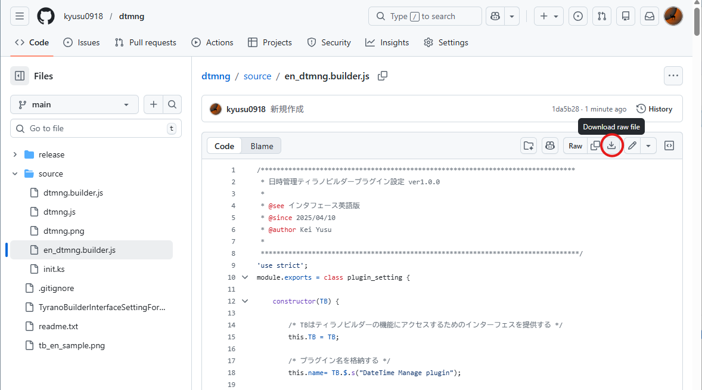
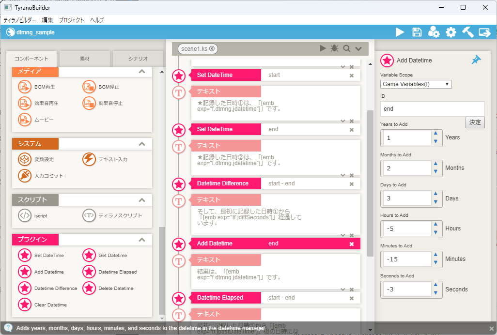

# How to switch the Tyrano Builder interface to English


## Prerequisites

>This assumes that the standard Japanese version of the plugin is installed.

## Step1 Close Editor

Please close the Tyrano Builder editor.

## Step2 Downlod File

Please download the Tyrano Builder plugin configuration file from below URL.

https://github.com/kyusu0918/dtmng/blob/main/source/en_dtmng.builder.js

Please click [Download raw file] button



## Step3 Rename File

Rename the downloaded **en_dtmng.builder.js** file to **dtmng.builder.js**.

## Step4 Overwrite File

Overwrite the Tyrano Builder plugin configuration file with the file you renamed in Step 3.

The **dtmng.builder.js** file is usually located in the following folder.

```
[Tyrano Builder Install Folder]\myproject\[Your Project Name]\data\others\plugin\dtmng
```

## Completes the setup

When you open Tyrano Builder, the plugin section will appear in English as shown below.

